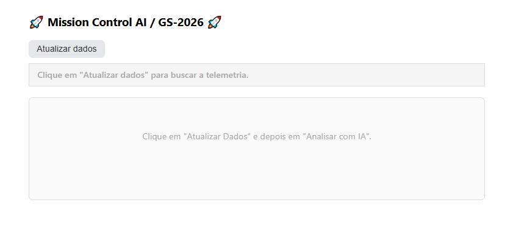
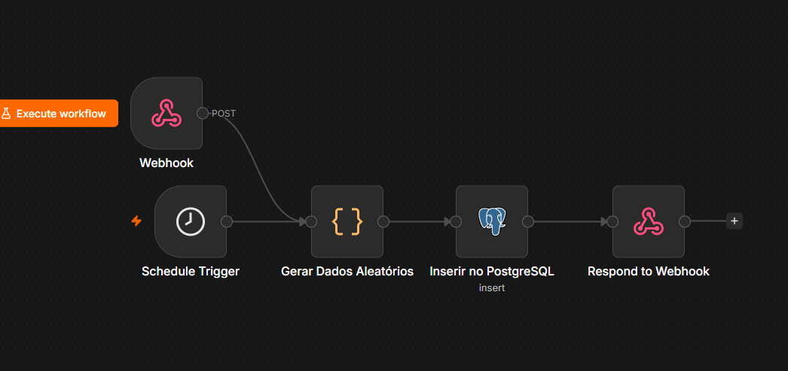
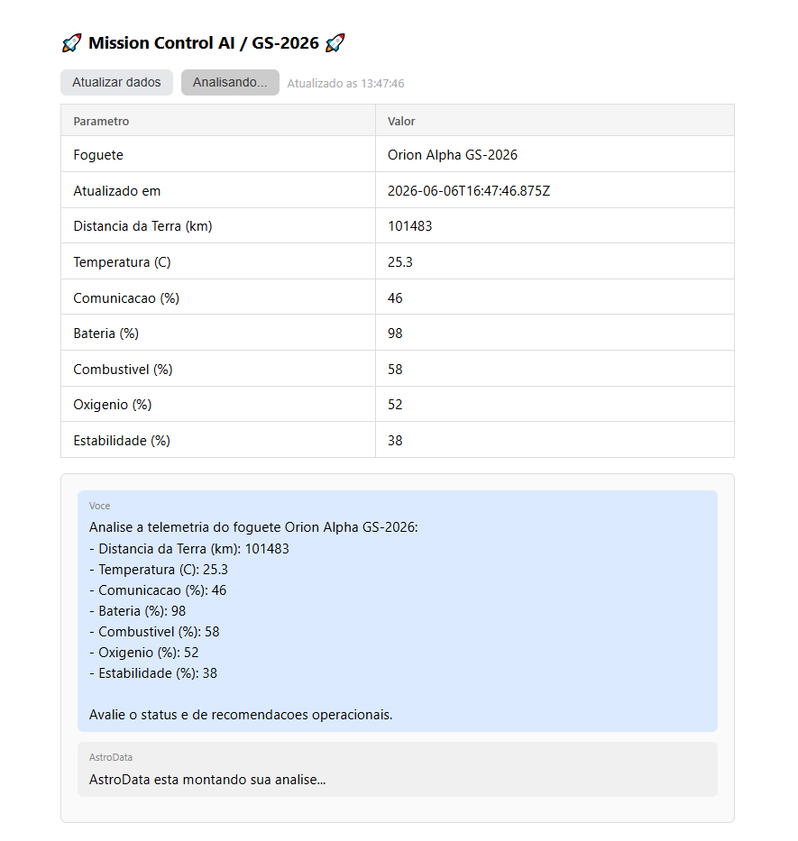
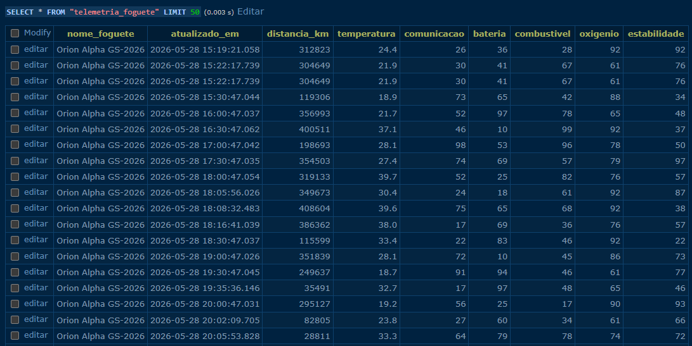

# Mission Control AI - AstroData

**Global Solution 2026.1 - Prompt and Artificial Intelligence**

## Equipe AstroTeam
- João Vitor Belchior Domingos Leite - RM: 572478
- Gabriel Pedro de Souza - RM: 571995

## O que o projeto faz
Sistema de monitoramento de missão espacial com IA. O n8n gera os dados dos sensores do foguete e salva no PostgreSQL. O painel web puxa esses dados via webhook e envia para o modelo Gemma rodando no Ollama da nossa VPS. A IA analisa a telemetria com base no system prompt e devolve o status da missão (Normal, Atenção ou Crítico) com alertas e recomendações.

## Como executar

🔗 **[Acessar Mission Control AI - AstroData](http://srv1596774.hstgr.cloud:8080/chat.html)**

1. Abrir o painel pelo link acima
2. Clicar em **"Atualizar dados"** para puxar a telemetria mais recente do banco
3. Quando os dados aparecerem, clicar em **"Analisar com IA"**
4. O Gemma retorna o relatório da missão com alertas e recomendações

## Demonstração

Painel web com a análise da IA:

Fluxo do n8n gerando os dados:

Detalhe do fluxo de geração de telemetria:

Telemetria no PostgreSQL:

## Tecnologias
- Frontend: HTML, CSS, JavaScript
- Backend/Orquestração: n8n
- Banco de Dados: PostgreSQL
- IA: Gemma 2B via Ollama
- Hospedagem: VPS própria

## Código fonte
- `chat.html` - frontend do painel (HTML + CSS + JavaScript que faz a integração com o webhook do n8n e com a IA via Ollama)
- `Fluxo_n8n.json` - workflow do n8n que gera a telemetria e persiste no PostgreSQL
- `Prompt_system.md` - system prompt usado para configurar o modelo Gemma

## Vídeo de demonstração
[Assistir no YouTube](https://youtu.be/EbjRTUfPaxk)
