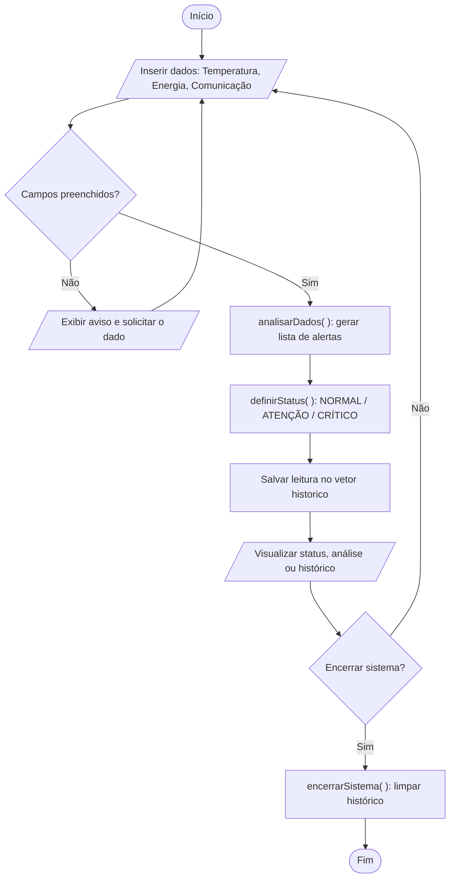

# Monitoramento de Missão Espacial — Sistema de Acompanhamento do Foguete

**Global Solution 2026.1 — Data Structure and Algorithms**
*Programação Aplicada ao Monitoramento de Missão Espacial*

## Equipe AstroTeam
- João Vitor Belchior - RM: 572478
- Gabriel Pedro de Souza - RM: 571995

## Descrição

Sistema desenvolvido em **JavaScript** (executado no navegador a partir de um arquivo HTML) que simula o monitoramento das condições operacionais de uma missão espacial experimental. O usuário insere os dados dos sensores (temperatura, energia e comunicação), e o sistema analisa automaticamente as condições, emite alertas, define o status operacional da missão e mantém um histórico de todas as leituras realizadas.

## Como executar

1. Faça o download do arquivo `Sistema_Acomp_Foguete.html`.
2. Abra o arquivo em qualquer navegador (duplo clique no arquivo ou arraste-o para a janela do navegador).
3. Não é necessário instalar nada — todo o sistema roda em JavaScript diretamente no navegador.

## Menu interativo (funcionalidades)

| Opção | Função | O que faz |
| :--- | :--- | :--- |
| Inserir dados | `inserirDados()` | Valida os campos, analisa os dados e cadastra a leitura no histórico. |
| Visualizar status | `visualizarStatus()` | Mostra a última leitura cadastrada e seu status operacional. |
| Executar análise | `executarAnalise()` | Lista todos os alertas gerados na última leitura. |
| Histórico das leituras | `mostrarHistorico()` | Percorre o histórico e exibe todas as leituras já registradas. |
| Encerrar sistema | `encerrarSistema()` | Limpa o histórico, reiniciando o sistema. |

## Explicação da lógica utilizada

### Estruturas de dados

- **`historico`** — vetor (array) que armazena todas as leituras realizadas. Cada leitura é um objeto contendo `temperatura`, `energia`, `comunicacao`, o vetor `alertas` e o `status` calculado.
- **`alertas`** — vetor criado a cada análise, preenchido dinamicamente conforme as condições dos sensores são avaliadas.

### Estruturas de controle

- **Condicionais (`if` / `else`)** — usadas tanto na validação da entrada de dados quanto na verificação automática dos sensores e na definição do status.
- **Laços de repetição (`for`)** — usados para percorrer o vetor de alertas (na análise) e o vetor de histórico (na listagem das leituras).
- **Funções** — cada responsabilidade do sistema foi isolada em uma função própria, mantendo o código organizado e reutilizável.

### Regras de verificação automática

Conforme o enunciado, o sistema avalia três condições a cada análise:

| Condição do sensor | Alerta gerado | Impacto no status |
| :--- | :--- | :--- |
| Temperatura > 80 | Alerta de superaquecimento | CRÍTICO |
| Energia < 20 | Economia de energia | ATENÇÃO |
| Comunicação = 0 (Falha) | Falha de comunicação | CRÍTICO |
| Nenhuma das anteriores | Tudo normal | NORMAL |

### Definição do status operacional

A função `definirStatus()` converte a lista de alertas em um status único:

- **CRÍTICO** — se houver alerta de superaquecimento **ou** falha de comunicação;
- **ATENÇÃO** — se houver alerta de economia de energia (e nenhum crítico);
- **NORMAL** — se nenhum alerta de risco foi gerado.

### Funções do sistema

- **`analisarDados(temperatura, energia, comunicacao)`** — aplica as condicionais sobre os sensores e retorna o vetor de alertas.
- **`definirStatus(alertas)`** — recebe o vetor de alertas e devolve o status operacional (NORMAL / ATENÇÃO / CRÍTICO).
- **`inserirDados()`** — valida os campos, monta o objeto da leitura e o adiciona ao vetor `historico`.
- **`visualizarStatus()`** — exibe a última leitura registrada.
- **`executarAnalise()`** — lista os alertas da última leitura junto ao status.
- **`mostrarHistorico()`** — percorre o vetor `historico` com um laço e exibe todas as leituras.
- **`encerrarSistema()`** — reinicia o vetor `historico`, encerrando a sessão.

## Fluxograma

> Versão em imagem também disponível no arquivo [`fluxograma.svg`](fluxograma.svg).

## Entregáveis

- **Código-fonte:** `Sistema_Acomp_Foguete.html`
- **Fluxograma:** seção acima (Mermaid) e arquivo `fluxograma.svg`
- **Explicação da lógica:** este `README.md`
- **Demonstração prática:** _adicionar aqui o link do vídeo de demonstração_
